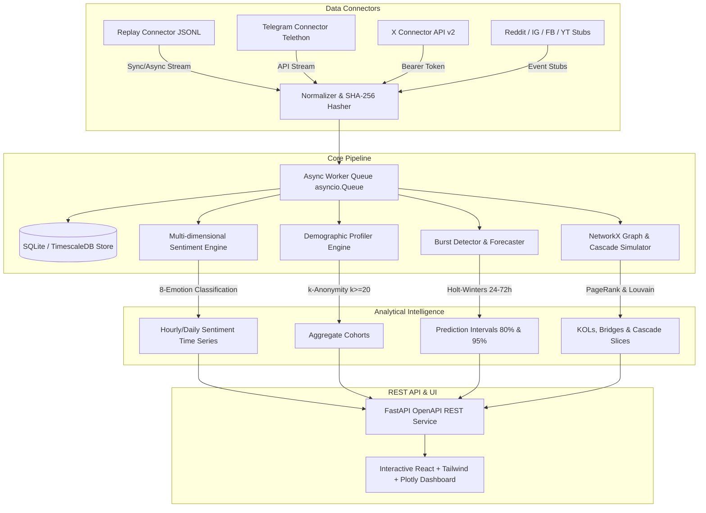

# Architecture & Technical Design Document

**SocialPulse** is a full-stack, AI-driven audience intelligence and social media analytics platform. It correlates follower sentiment, demographic profiles, rising trend bursts, and influence topology along a unified timestamped timeline.

---

## 1. System Architecture Overview

---

## 2. Core Mathematical Formulations

### A. Burst Detection & Trend Scoring
To identify viral breakouts before raw volume peaks, we compute:
$$\text{Velocity} = \frac{\Delta \text{Volume}}{\Delta t} = \frac{1}{|W|} \sum_{t \in W} V_t$$
$$\text{Acceleration} = \text{Velocity}_t - \text{Velocity}_{t-1}$$
$$\text{UniqueUserSpread} = \frac{\text{Unique Users in Topic}}{\text{Total Active Audience}}$$
$$\text{TrendScore} = \text{Velocity} \times \max(0.1, 1.0 + 0.2 \cdot \text{Acceleration}) \times \text{UniqueUserSpread} \times 10.0$$

### B. Holt-Winters 24-72h Forecasting & Uncertainty Bands
We model trend level $L_t$ and trend slope $b_t$:
$$L_t = \alpha Y_t + (1 - \alpha)(L_{t-1} + b_{t-1})$$
$$b_t = \beta (L_t - L_{t-1}) + (1 - \beta)b_{t-1}$$
$$\hat{Y}_{t+h} = L_t + h \cdot b_t \cdot e^{-0.03 h}$$

Uncertainty cones widen with forecast horizon $h$:
$$\sigma_h = \sigma_{\text{residual}} \sqrt{1 + 0.15 h}$$
$$\text{CI}_{80} = \max(0, \hat{Y}_{t+h} \pm 1.282 \cdot \sigma_h)$$
$$\text{CI}_{95} = \max(0, \hat{Y}_{t+h} \pm 1.960 \cdot \sigma_h)$$

### C. Network Topology & Information Cascade
- **PageRank**: Computes node authority across interaction matrices:
  $$PR(u) = \frac{1-d}{N} + d \sum_{v \in M(u)} \frac{PR(v)}{L(v)}$$
- **Louvain Modularity**: Partitions the graph into densely connected audience communities.
- **Bridge Nodes**: High betweenness nodes with edges incident on multiple Louvain partitions.
- **Cascade Simulation**: Quantizes temporal interaction traces into $S$ discrete intervals:
  $$\text{CascadeStep}_s = \left(\text{timestamp}_s, \text{active\_nodes}_s, \text{new\_infections}_s, \text{community\_breakdown}_s, \text{dominant\_emotion}_s\right)$$
