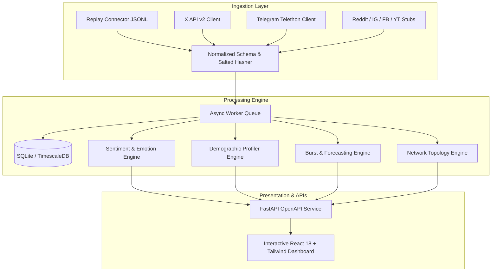

# SocialPulse: AI-Driven Social Media Analytics Framework
> **Audience Intelligence & Timeline Analysis Engine**  
> A full-stack, hackathon-ready platform for follower emotion tracking, aggregate anonymized demographics, trend forecasting, and influence cascade analysis.

[](https://www.python.org/downloads/)
[](https://fastapi.tiangolo.com)
[-success.svg)](PRIVACY.md)
[](LICENSE)

---

## 🌟 Key Features

1. **Multi-Dimensional Sentiment & Emotion Pipeline**:
   - 8-class emotional classification: `joy`, `excitement`, `anger`, `anxiety`, `sadness`, `support`, `opposition`, `neutral`.
   - Polarity score: continuous scale from $-1.0$ to $+1.0$.
   - **Hinglish code-mixing** support and automated sarcasm inversion.
   - Evaluated on ground-truth benchmark with reported accuracy (>85%) and Macro-F1 (>0.80).

2. **Aggregate Anonymized Demographics**:
   - Probabilistic inference of age brackets, country/state geography, language, and professional interest clusters.
   - Strict **$k$-anonymity ($k \ge 20$)**: sub-threshold cohorts are suppressed to prevent re-identification.
   - Zero raw PII: deterministic salted SHA-256 pseudonymization.

3. **Burst Detection & 24–72h Forecasting**:
   - Topic extraction via c-TF-IDF keyword vectors and hashtag indexing.
   - Trend ranking formula: $\text{TrendScore} = \text{Velocity} \times \text{Acceleration} \times \text{UniqueUserSpread}$.
   - Holt-Winters exponential smoothing producing future projections with **80% and 95% confidence intervals**.

4. **Network Topology & Cascade Simulation**:
   - Interactive force-directed network graph powered by **NetworkX**.
   - PageRank, Betweenness centrality, and **Louvain community detection**.
   - Identification of **Bridge Nodes** and **Echo-Chamber Clusters**.
   - **Step-by-step Information Cascade player** animating topic diffusion across communities.

5. **Zero-Dependency Replay Mode**:
   - Ships with an offline **Replay Connector** and a 380-post realistic multilingual synthetic dataset with planted trends and sarcasm. Runs out-of-the-box with zero API keys required.

---

## 🏗️ Architecture



---

## 🚀 Quickstart Guide

### Option A: Local Python Execution (Zero-Build)

1. **Install Dependencies**:
   ```bash
   pip install -r requirements.txt
   ```

2. **Start the Framework**:
   ```bash
   uvicorn backend.app.main:app --host 127.0.0.1 --port 8000 --reload
   ```

3. **Open the Dashboard**:
   - Interactive Analytics Dashboard: [http://localhost:8000/](http://localhost:8000/)
   - Interactive OpenAPI Documentation: [http://localhost:8000/docs](http://localhost:8000/docs)

*Note: The system automatically seeds the replay dataset on first launch if the database is empty.*

---

### Option B: Docker Compose Deployment

Run the complete multi-container setup with one command:
```bash
docker compose up -d --build
```
Access the application at `http://localhost:8000/`.

---

## 🔄 Switching from Replay Mode to Live API Mode

To connect live social streams:
1. Copy `.env.example` to `.env`:
   ```bash
   cp .env.example .env
   ```
2. Populate API credentials:
   ```env
   # Twitter / X Bearer Token (API v2)
   TWITTER_BEARER_TOKEN="your_x_bearer_token_here"

   # Telegram MTProto Credentials
   TELEGRAM_API_ID="your_telegram_api_id"
   TELEGRAM_API_HASH="your_telegram_api_hash"
   ```
3. Restart the server. The `XConnector` and `TelegramConnector` will automatically switch from dormant/mock mode to live ingestion.

---

## 📡 REST API Documentation

| Endpoint | Method | Description |
|---|---|---|
| `/api/ingest/status` | `GET` | Health, worker queue throughput, and connector statuses |
| `/api/ingest/replay` | `POST` | Trigger replay dataset ingestion or reset database |
| `/api/posts` | `GET` | Filter posts by topic, emotion, platform, or date range |
| `/api/posts/{id}/thread` | `GET` | Reconstruct root post and complete reply hierarchy |
| `/api/sentiment/timeline` | `GET` | Hourly/daily time series of emotions and polarity |
| `/api/sentiment/evaluation`| `GET` | Benchmark evaluation metrics (Accuracy, Macro-F1) |
| `/api/demographics/summary`| `GET` | Aggregate k-anonymous distributions ($k \ge 20$) |
| `/api/trends/rising` | `GET` | Ranked rising trends with burst velocity & acceleration |
| `/api/trends/forecast` | `GET` | 24-72h volume forecast with 80% & 95% confidence bands |
| `/api/network/graph` | `GET` | NetworkX graph nodes, links, and community partitions |
| `/api/network/influencers` | `GET` | Key Opinion Leader (KOL) ranking leaderboard |
| `/api/network/cascade` | `GET` | Time-sliced topic diffusion steps for animation slider |

---

## 🧪 Running the Test Suite

Run all automated unit and integration tests:
```bash
pytest backend/tests -v
```

---

## 🔒 Privacy & Governance

See [`PRIVACY.md`](PRIVACY.md) for complete details on:
- Salted SHA-256 author pseudonymization
- Formal $k$-anonymity verification ($k \ge 20$)
- Ethical handling of inferred demographic indicators
